# HD827sonic - two samples (one with two libraries)

Rulegraph

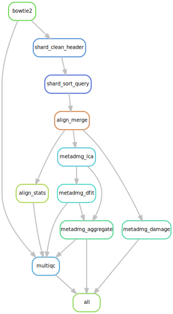

DAG

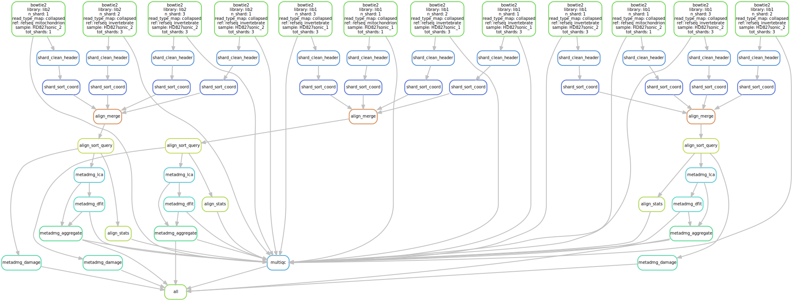

Filegraph

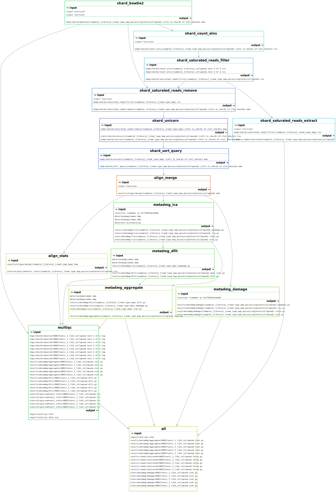

# HD827sonic - two samples (read reassign but no filter)

Rulegraph

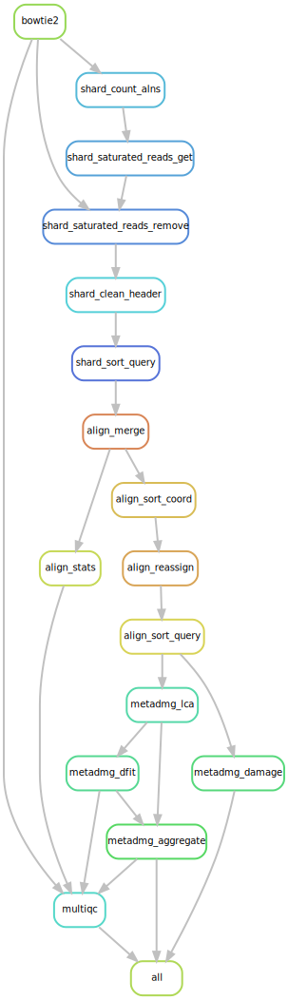

DAG

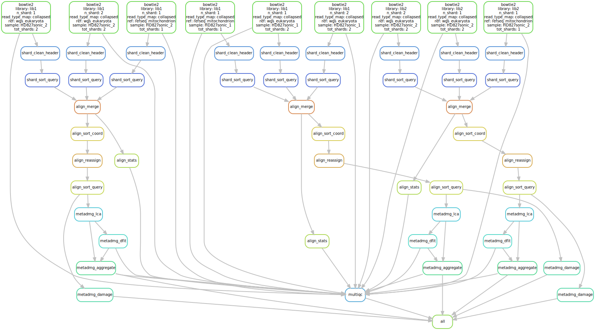

Filegraph

# HD827sonic - two samples (no read reassign but filter)

Rulegraph

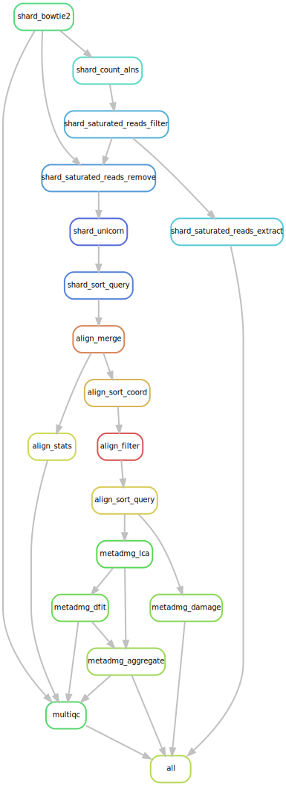

DAG

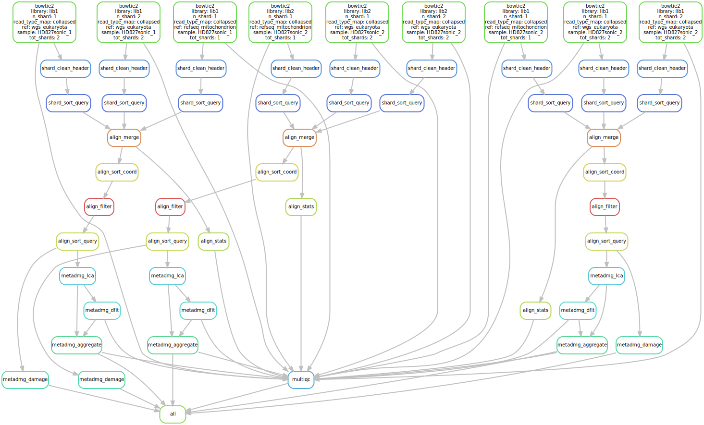

Filegraph

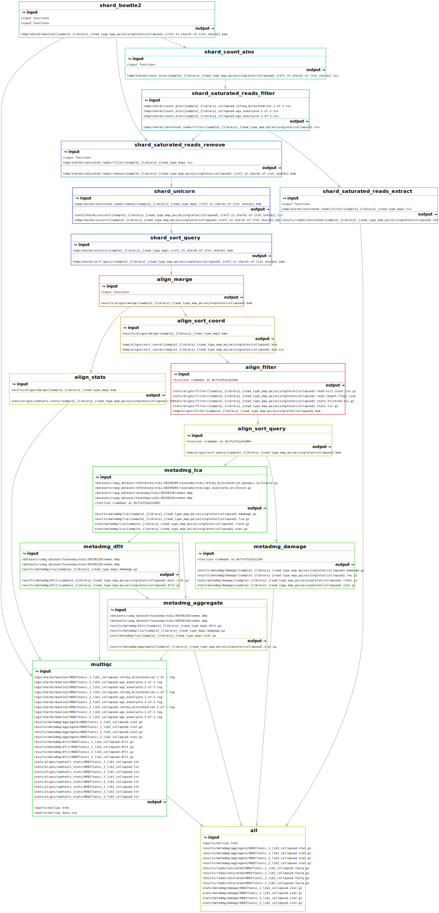

# HD827sonic - two samples (both read reassign and filter)

Rulegraph

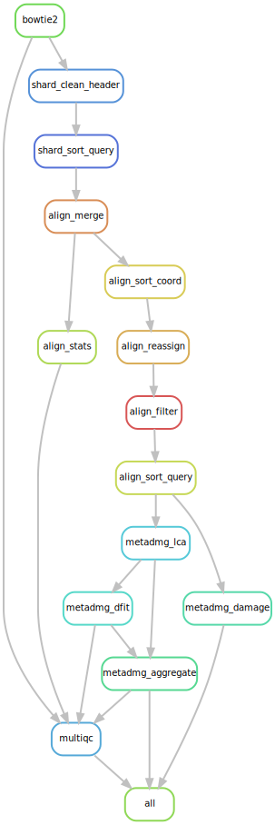

DAG

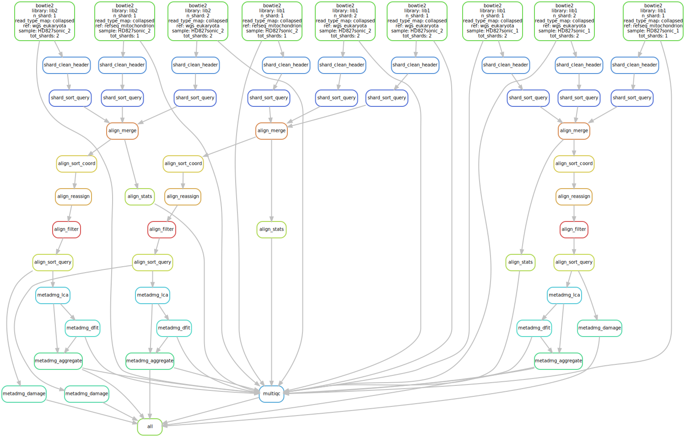

Filegraph

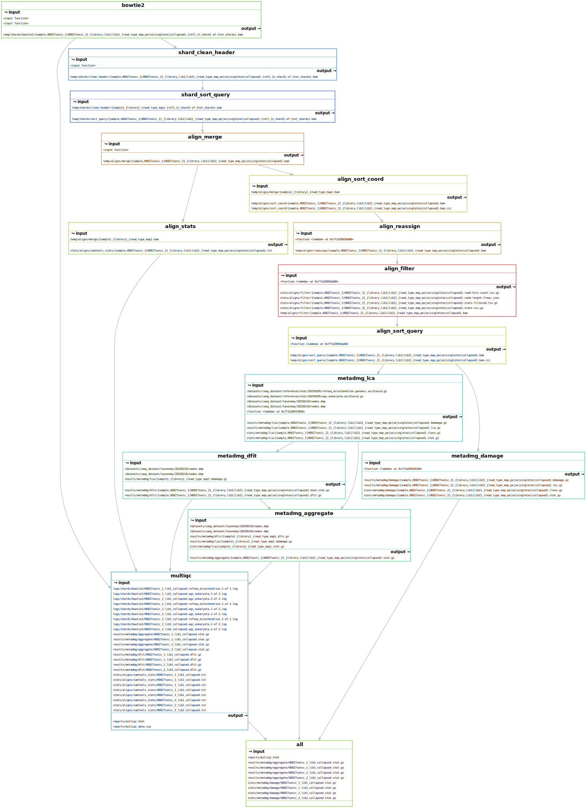

